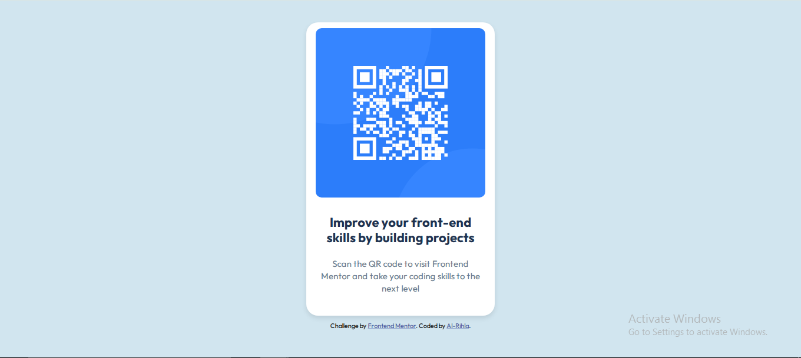

# Frontend Mentor - QR code component solution

This is a solution to the [QR code component challenge on Frontend Mentor](https://www.frontendmentor.io/challenges/qr-code-component-iux_sIO_H). Frontend Mentor challenges help you improve your coding skills by building realistic projects. 

## Table of contents

- [Overview](#overview)
  - [Screenshot](#screenshot)
  - [Links](#links)
- [My process](#my-process)
  - [Built with](#built-with)
  - [Continued development](#continued-development)
  - [Useful resources](#useful-resources)
- [Author](#author)
- [Acknowledgments](#acknowledgments)

## Overview

### Screenshot

### Links

- Solution URL: [Solution URL is here](https://www.frontendmentor.io/solutions/qr-component-7oI0AbP6TH)
- Live Site URL: [Live site is here](https://al-rihla.github.io/development/)

## My process

### Built with

- HTML5
- CSS
- Flexbox

### Continued development

- I want to focus on CSS media queries as well as responsive design.

### Useful resources

- [Chat GPT](https://chatgpt.com/)
- [Sheryians Coding School](https://www.youtube.com/@sheryians)

## Author

- Frontend Mentor - [@Al-Rihla](https://www.frontendmentor.io/profile/Al-Rihla)

## Acknowledgments

I acknowledge that I took help from resources generated by ChatGPT and Sheryian Coding School when developing this project. Sheryians' Youtube channel has a lot of videos on Front End Development. I watched this video, [Web Development Course | Frontend | Level 1](https://www.youtube.com/watch?v=9cmy6AK3IBA) which helped a lot.
